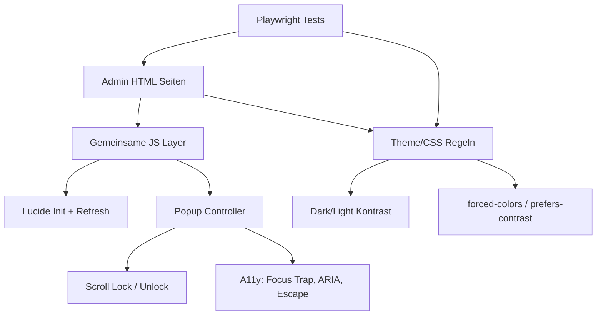

# Admin-Flächen & Popups auf Lucide + einheitliches UI — Implementation Plan

> Derived from `spec.md`. The plan translates *what* (spec) into *how*.
> Do not introduce new behaviour here — if the plan needs a behaviour that is
> not in the spec, go back and update the spec first.

**Spec:** [spec.md](./spec.md)

**Status:** Draft

## Constitution Check

Confirm the plan complies with `.specify/memory/constitution.md`:

- [x] Spec exists and has no open `[NEEDS CLARIFICATION]` markers
- [x] On-prem compatibility respected (no cloud-only APIs)
- [x] No secrets introduced into the repo
- [x] Follows existing folder conventions

## Technical Approach

Die Umstellung erfolgt in drei Schichten:

1. **Globale UI-Infrastruktur**
   - Zentrale Lucide-Initialisierung und Re-Render-Hooks für dynamische DOM-Updates.
   - Gemeinsame Popup-Hilfen (Open/Close/Scroll-Lock/Fokus) für Admin-Seiten.

2. **Seitenweise Admin-Migration**
   - Verbindlicher Scope: `cms.html`, `kiosk.html`, `shop-admin.html`,
     `bestellungen.html`, `pack.html`, `portal.html`, `lunch-admin.html`,
     `shop-freigabe.html`.
   - Ersetzen von Emoji-/Alt-Icons durch Lucide.
   - Harmonisierung von Popup-Struktur und Schließverhalten.

3. **Lesbarkeit & Systemfarben-Härtung**
   - Dark/Light-Kontrastregeln + Mindestschriftgrößen aus `specs/conventions.md`.
   - Unterstützung für `forced-colors` und `prefers-contrast`.
   - Regressionstests auf mobile/iPad-mini/desktop inklusive Lesbarkeitschecks.

## Key Decisions

| Decision | Options considered | Choice & rationale |
| --- | --- | --- |
| Icon-Migration | Seite für Seite lokal vs. zentrale Initialisierung + Seiteanpassungen | Zentrale Initialisierung + seitenweise Anpassung, um Redundanz zu senken und dynamische Inhalte konsistent zu halten. |
| Popup-Standard | Nur visuell vereinheitlichen vs. visuell + A11y-Basis | Visuell + A11y-Basis (Fokusfalle, ARIA, Escape), da in der Spec verbindlich festgelegt. |
| Lesbarkeitsprüfung | rein visuell vs. visuell + technische Kontrastchecks | Kombination aus beidem, um subjektive und objektive Lesbarkeit (60+ Zielgruppe) abzudecken. |
| High-Contrast | ignorieren vs. explizit unterstützen | Explizite Unterstützung für `forced-colors`, um System-Color-Einstellungen robust abzudecken. |

## Architecture

Die bestehende Architektur bleibt erhalten (statische Seiten + gemeinsames JS/CSS),
es werden keine neuen Frameworks eingeführt.

## File-Level Change Map

| Path | Change | Purpose |
| --- | --- | --- |
| `static-site/js/theme.js` | edit | Lucide-Refresh robust für dynamische Admin-DOM-Änderungen; ggf. gemeinsame Helper exportieren. |
| `static-site/js/*.js` (admin-bezogen, z. B. `cms.js`, `kiosk`-/`shop-admin`-Skripte) | edit | Emoji/Alt-Icons ersetzen; Popup-Aufrufe auf Standardpfad umstellen. |
| `static-site/css/style.css` | edit | Gemeinsame Lesbarkeits-/Kontrastregeln inkl. System-Color-Absicherung. |
| `static-site/css/content.css` | edit | Entsprechende Regeln für Unterseiten/Admin-Ansichten, damit Verhalten nicht auseinanderläuft. |
| `static-site/*.html` (Scope-Seiten) | edit | Semantische Dialogattribute (`role`, `aria-modal`, Labels), konsistente Popup-Struktur, Lucide-Markup. |
| `tests/*.spec.js` (admin-relevant) | edit/new | E2E-Regression für Icons, Popups, Lesbarkeit, High-Contrast-Szenarien. |
| `tests/TESTCASES.md` | edit | Dokumentation neuer/angepasster Testfälle und Läufe. |
| `specs/conventions.md` | edit | Globale Lesbarkeits-/Systemfarben-Pflicht (bereits ergänzt). |

## Test Strategy

- **Unit:**
  - Wo sinnvoll, JS-Helfer für Popup-Open/Close/Fokus/Scroll-Lock isoliert prüfen.

- **Integration / E2E:**
  - Admin-Flows auf `mobile`, `ipad-mini`, `desktop`.
  - Icon-Rendering (Lucide vorhanden, keine Emoji-Fallbacks in Zielbereichen).
  - Popup-Interaktion (X/Backdrop/Escape, keine Fehlschließung intern).
  - Lesbarkeit (Light/Dark) und High-Contrast (`forced-colors`) auf kritischen Screens.

- **Mapping:**
  - F1 → `TC-F1-01`, `TC-F1-02`
  - F2 → `TC-F2-01`, `TC-F2-02`, `TC-F2-03`
  - F3 → `TC-F3-01`, `TC-F3-02`, `TC-F3-03`, `TC-F3-04`
  - F4 → `TC-F4-01`, `TC-F4-02`

## Risks & Mitigations

| Risk | Impact | Mitigation |
| --- | --- | --- |
| Seitenspezifische Alt-Styles überschreiben neue Kontrastregeln | high | Schrittweise Migration pro Seite + gezielte CSS-Scopes + visuelle Snapshots. |
| Popup-Refactor verursacht Regressions bei bestehenden Flows | high | Standardisierte Popup-Helper, Regressionstests für alle Close-Pfade. |
| Dynamische DOM-Updates verlieren Icons | med | Nach jedem Renderpfad Lucide-Refresh zentral triggern; E2E-Test für dynamische Listen. |
| High-Contrast Verhalten variiert je Browser | med | Primär Windows/Edge validieren; Systemfarben-Fallbacks statt hartkodierter Farben. |

## Rollout

1. Umsetzung auf `feature/bestellsystem` in kleinen, testbaren Schritten.
2. Nach jedem Teilabschnitt relevante Playwright-Tests auf 3 Viewports.
3. Abschluss-Suite für alle betroffenen Admin-Flows.
4. Formale Abnahme auf `feature/bestellsystem`.
5. Finaler Smoke-Check auf `dev` vor Merge.
