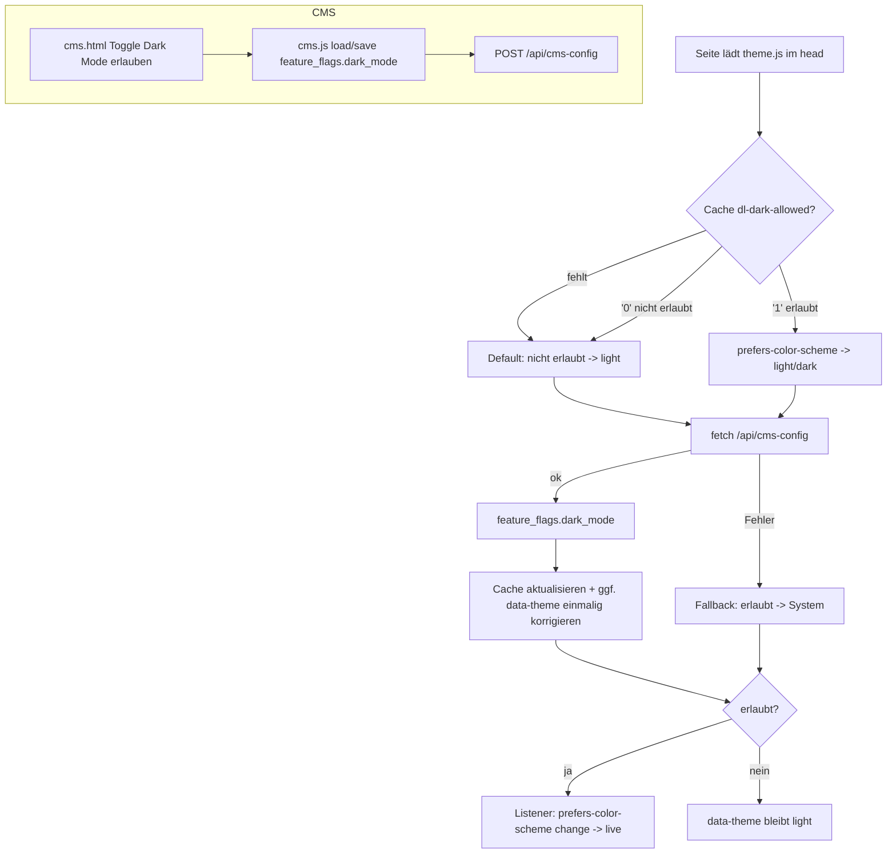

# Dark-Mode-Freigabe (CMS-Einstellung) — Implementation Plan

> Abgeleitet aus [spec.md](./spec.md). Der Plan übersetzt *was* (Spec) in *wie*.
> Keine neue Behaviour hier — falls nötig, erst die Spec aktualisieren.

**Spec:** [spec.md](./spec.md)

**Status:** Draft

## Constitution Check

- [x] Spec existiert und hat **keine** offenen `[NEEDS CLARIFICATION]`-Marker
- [x] On-prem-/Cloud-neutral: nutzt nur die bestehende `GET /api/cms-config`
      (keine neuen cloud-only APIs)
- [x] Keine Secrets im Repo (nur ein Boolean-Flag in bestehender Config)
- [x] Folgt bestehenden Konventionen (`feature_flags`-Muster, `theme.js` als
      zentraler Controller, Spec unter `specs/`)
- [x] User-facing Meldungen benutzerfreundlich (Toast im CMS, §6)
- [x] Responsive über 3 Viewports + automatisierte Playwright-Tests (§7/§8)

## Technical Approach

Zentraler Punkt: **[static-site/js/theme.js](../../static-site/js/theme.js) ist
auf allen Seiten eingebunden** (öffentlich **und** Admin) und ist der einzige
Theme-Controller. Damit lebt die gesamte Laufzeit-Logik (F2/F3/F4) in genau
einer Datei — es sind **keine pro-Seite-HTML-Änderungen** nötig.

Ablauf in `theme.js`:

1. **Pre-Paint (synchron):** Lies den gecachten Freigabewert
   `localStorage['dl-dark-allowed']`. Fehlt er → Annahme „nicht erlaubt" (Default
   = hell). Setze `data-theme` sofort:
   - nicht erlaubt → `light`
   - erlaubt → `prefers-color-scheme` (strikt System).
2. **Async:** `fetch('/api/cms-config')` → `feature_flags.dark_mode`.
   - Erfolg: Cache `dl-dark-allowed` aktualisieren; falls sich der effektive
     Zustand ändert, `data-theme` **einmalig** korrigieren.
   - Fehler/Timeout: **Fallback „erlaubt"** (System) — heutiges Verhalten.
3. **System-Listener:** Bei „erlaubt" reagiert `theme.js` live auf
   `prefers-color-scheme`-Change. Bei „nicht erlaubt" bleibt es `light`.
4. **Kein manueller Umschalter:** Der bisherige Floating-Button
   `#dl-theme-toggle` und die manuelle Wahl entfallen; `dl-theme` wird nicht mehr
   gesetzt und bei „nicht erlaubt" ignoriert (nicht gelöscht).

CMS (F1): Ein weiterer Toggle im bestehenden „Feature-Einstellungen"-Block, an
`feature_flags.dark_mode` gebunden — analog zu den vorhandenen Schaltern
(`push`, `scanner`, …) in [static-site/cms.js](../../static-site/cms.js).

## Key Decisions

| Decision | Options considered | Choice & rationale |
| --- | --- | --- |
| Ort der Laufzeit-Logik | pro-Seite-Skripte vs. zentral in `theme.js` | **`theme.js` zentral** — bereits überall eingebunden, minimale Angriffsfläche, keine 20+ HTML-Edits |
| Flag-Speicherung | neuer Config-Key vs. `feature_flags`-Objekt | **`feature_flags.dark_mode`** — nutzt vorhandenes Lade-/Speicher-/CMS-UI-Muster, kein neuer Endpunkt |
| Default bei fehlendem Wert | erlaubt vs. nicht erlaubt | **nicht erlaubt** (Spec-Entscheidung 1) → `flags.dark_mode === true` = erlaubt |
| Flackerfreiheit | immer async vs. localStorage-Cache | **Cache `dl-dark-allowed`** für Pre-Paint (Spec-Entscheidung 5); async nur zur Korrektur |
| Fallback bei API-Fehler | hell vs. System | **erlaubt/System** (Spec-Entscheidung 4) — fail-open zum heutigen Verhalten |
| Manueller Umschalter | behalten vs. entfernen | **entfernen** (Spec-Entscheidung 3, strikt System) — Button-Injektion raus |

## Architecture

## File-Level Change Map

| Path | Change | Purpose |
| --- | --- | --- |
| [static-site/js/theme.js](../../static-site/js/theme.js) | edit | Pre-Paint-Cache-Logik, `fetch('/api/cms-config')`, „nicht erlaubt → light", strikt System bei erlaubt, Fallback, **Button-Injektion entfernen**, `dl-theme` ignorieren |
| [static-site/cms.html](../../static-site/cms.html) | edit | Neuer Toggle „🌙 Dark Mode erlauben" im „Feature-Einstellungen"-Block (`id="feat-darkmode"`) |
| [static-site/cms.js](../../static-site/cms.js) | edit | `feat-darkmode` in `loadFeatureFlags()`/`saveFeatureFlags()` lesen/schreiben (`flags.dark_mode`) |
| `tests/dark-mode-setting.spec.js` | new | Playwright-E2E für TC-F1..TC-F4 über 3 Viewports |
| **kein** | — | Keine pro-Seite-HTML-Änderung (theme.js ist zentral) |

> Offen für Plan-Review: exakte CSS-Selektoren der Dark-Regeln bleiben
> unverändert (Non-Goal). `#dl-theme-toggle`-CSS in den Seiten kann bleiben
> (toter Stil) oder später entfernt werden — kein Funktionsbezug.

## Test Strategy

- **Unit-nah (im Browser via Playwright `evaluate`):** effektive Theme-Berechnung
  (erlaubt/nicht-erlaubt × System hell/dunkel × Cache).
- **E2E (Playwright, 3 Viewports 375×667 / 768×1024 / 1280×800):** Seiten-Rendering
  hell/dunkel, Admin-Scope, Live-System-Wechsel, Flackerfreiheit, API-Fehler.
- **CMS:** Toggle-Load/Save gegen gemockte/echte `/api/cms-config`.

| Test Case | Umsetzung |
| --- | --- |
| TC-F1-01/02/03 | CMS lädt/speichert `feature_flags.dark_mode`; Netzwerk-Assert auf POST-Body |
| TC-F2-01/02 | `dark_mode=false` erzwingt `data-theme=light` trotz System-dunkel / gesetztem `dl-theme` (+ Assert: `dl-theme` unverändert) |
| TC-F2-03 | `dark_mode=true`, System-dunkel → `data-theme=dark` |
| TC-F2-04 | Admin-Seiten (`/cms`,`/kiosk`,`/shop-admin`) bei `dark_mode=false` → light |
| TC-F2-05 | `/`,`/sortiment`,`/oeffnungszeiten` × 3 Viewports → light, kein Overflow |
| TC-F3-01 | `#dl-theme-toggle` existiert nicht |
| TC-F3-02 | `dark_mode=true`: `emulateMedia` dunkel → live `data-theme=dark` |
| TC-F3-03 | `dark_mode=false`: System-Wechsel → bleibt light |
| TC-F4-01 | Cache `'1'` + System-dunkel → erster Frame dunkel |
| TC-F4-02 | `/api/cms-config` per `route.abort()` → Fallback System |
| TC-F4-03 | `dark_mode=false`, Cache leer → nach Settle stabil light |

Config-Zustände werden im Test über `page.route('**/api/cms-config', …)` gemockt,
damit die Tests deterministisch und ohne echte CMS-Daten laufen.

## Risks & Mitigations

| Risk | Impact | Mitigation |
| --- | --- | --- |
| Flash beim ersten Besuch (kein Cache) | mittel | Default „nicht erlaubt" pre-paint = hell; nur eine einmalige Korrektur nach Config-Load |
| Zusätzlicher `fetch` pro Seitenload | niedrig | `/api/cms-config` ist klein und wird teils ohnehin geladen; ggf. kurze In-Memory-/localStorage-TTL |
| `theme.js` lädt vor `<body>` → `fetch` früh | niedrig | `fetch` ist async; Pre-Paint nutzt nur synchronen Cache |
| Admin-Nutzer verlieren gewohnten Dark Mode | niedrig | bewusste Entscheidung (Scope = alle); via CMS jederzeit aktivierbar |
| Entfernter Umschalter verwirrt Nutzer | niedrig | strikt System ist die getroffene Entscheidung; Doku/Release-Note |

## Rollout

- Reiner Frontend-Change (statische Assets + `theme.js`); Deploy über den
  bestehenden SWA-GitHub-Actions-Flow bei Push auf `feature/bestellsystem`.
- Kein API-/Infra-Change. Rückrollbar per Revert der drei Dateien.
- Nach Deploy: Playwright-Spec grün über 3 Viewports; manueller Smoke-Test
  CMS-Toggle → öffentliche Seite + eine Admin-Seite.
- Empfohlener Default nach Go-Live: `dark_mode` bewusst im CMS setzen
  (Default sonst „aus" = hell).
