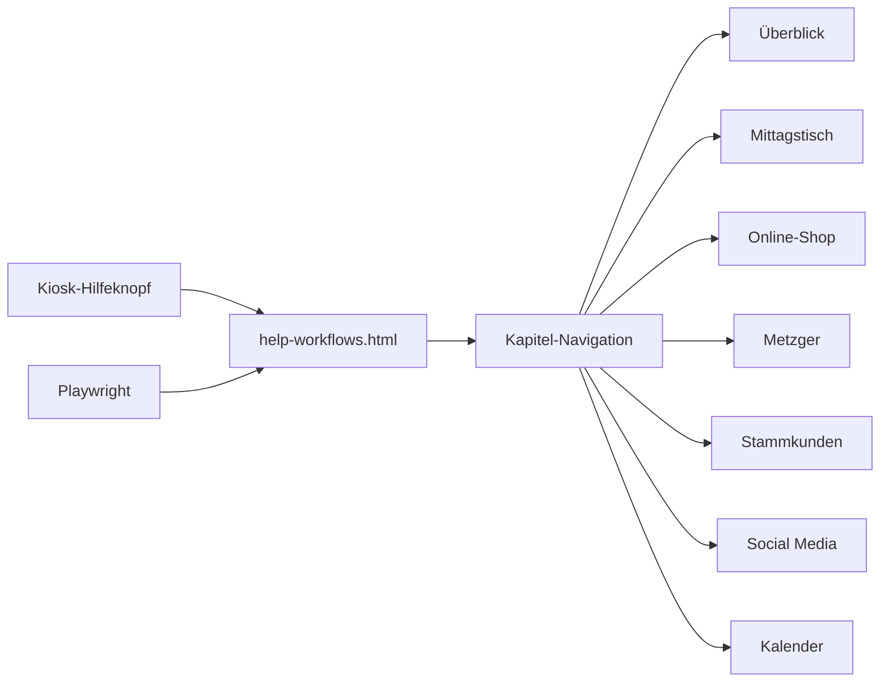

# Kiosk-Handbuch — Implementation Plan

**Spec:** [spec.md](./spec.md)

**Status:** Ready

## Constitution Check

- [x] Spec exists and has no open `[NEEDS CLARIFICATION]` markers
- [x] Keine Cloud- oder Plattformabhängigkeit wird neu eingeführt
- [x] Keine Secrets werden eingeführt
- [x] Bestehende Ordner- und Dateikonventionen werden eingehalten
- [x] Mitarbeitenden-Text bleibt frei von technischen Details
- [x] Responsive Prüfung erfolgt in allen drei vorgeschriebenen Viewports

## Technical Approach

Die statische Hilfe wird inhaltlich vollständig neu aufgebaut, während URL und Kapitel-IDs erhalten bleiben. Die Seite verwendet semantische HTML-Strukturen, eine scrollbare Tab-Leiste und kompakte UI-Skizzen mit Text und CSS. Jeder Fachbereich folgt demselben Muster: Orientierung, Standardablauf, konkrete Szenarien, Ausnahme/Korrektur und ein Ergebnis- oder Prüfhinweis.

Der Inhalt wird ausschließlich aus aktuellem Kiosk-Quellcode und vorhandenen Spezifikationen abgeleitet. Ein neuer Playwright-Test prüft Struktur, Navigation, Fachbegriffe, Ausschluss falscher Inhalte und responsive Darstellung.

## Key Decisions

| Decision | Options considered | Choice & rationale |
| --- | --- | --- |
| Dokumentstruktur | Eine lange Seite oder Kapitel-Tabs | Sieben Tabs bleiben erhalten, weil der Kiosk diese Hilfe bereits so öffnet und Mitarbeitende gezielt zu einem Bereich springen können. |
| Bildliche Erklärung | Screenshots oder wartbare UI-Skizzen | CSS-basierte, beschriftete Skizzen; sie zeigen die relevanten Bedienmuster ohne veraltete Live-Daten und sind responsiv. |
| Sprachstil | Umgangssprache oder professionelles Standarddeutsch | Sachliche „Sie“-Ansprache mit kurzen Sätzen, weil die Hilfe im Geschäftsbetrieb eingesetzt wird. |
| Inhaltliche Quelle | Bestehende Hilfeseite oder aktueller Kiosk | Aktueller Quellcode plus Spezifikationen; die bestehende Seite ist nachweislich fehlerhaft. |
| Social-Teilen | Einheitliche Wirkung behaupten oder Geräteabhängigkeit erklären | Geräteabhängigkeit ausdrücklich erklären, da Web Share, Zwischenablage und Download je nach Gerät variieren. |
| Kalenderänderungen | Serienbearbeitung beschreiben oder nur belegte Aktionen | Nur belegte Funktionen: neu anlegen, erledigen, einzelnen Tag entfernen, Serie ab Datum beenden. |

## Architecture

## File-Level Change Map

| Path | Change | Purpose |
| --- | --- | --- |
| `specs/kiosk-handbuch/spec.md` | new | Anforderungen und Testfälle für das korrigierte Handbuch |
| `specs/kiosk-handbuch/plan.md` | new | Technischer und redaktioneller Umsetzungsplan |
| `specs/kiosk-handbuch/tasks.md` | new | Geordnete, testbare Umsetzungsschritte |
| `static-site/help-workflows.html` | edit | Vollständiges professionelles Kiosk-Handbuch |
| `tests/kiosk-handbuch.spec.js` | new | Navigation, Inhalt und Responsive-Verhalten prüfen |

## Test Strategy

- **Static content:** Erwartete Kapitel, sichtbare UI-Bezeichnungen und Szenario-Überschriften prüfen; verbotene bzw. sachlich falsche Begriffe ausschließen.
- **Interaction:** Alle Tabs per Klick sowie Navigation per Pfeiltasten prüfen; sichtbaren Abschnitt und ARIA-Zustand abgleichen.
- **Responsive:** In den Playwright-Projekten mobile, iPad mini und desktop auf horizontalen Überlauf sowie erreichbare Navigation prüfen.
- **Diagnostics:** HTML/JS-Diagnosen für geänderte Dateien abrufen.
- **Mapping:** `tests/kiosk-handbuch.spec.js` deckt alle Testfälle `TC-F1-*` bis `TC-F4-*` ab.

## Risks & Mitigations

| Risk | Impact | Mitigation |
| --- | --- | --- |
| Dokumentation driftet erneut vom Kiosk ab | high | Exakte sichtbare Bezeichnungen testen und Quellen im Spec festhalten. |
| Praxisbeispiele führen unbemerkt neue Funktionen ein | high | Jedes Szenario auf eine nachgewiesene Aktion und ein belegtes Ergebnis begrenzen. |
| Lange Kapitel sind auf kleinen Geräten schwer bedienbar | medium | Kurze Absätze, nummerierte Schritte, horizontale Tab-Leiste und responsive Karten. |
| Social-Teilen verhält sich je nach Gerät anders | medium | Keine automatische App-Öffnung versprechen; Teilen, Zwischenablage und Download als mögliche Gerätewege erklären. |
| Live-Test sieht vor Deployment noch alte Seite | medium | Zuerst lokal gegen einen temporären statischen HTTP-Server testen, danach deployen und live erneut prüfen. |

## Rollout

Nach lokalen Tests wird die Änderung auf `feature/bestellsystem` committed und gepusht. Die zugehörige GitHub-Actions-Bereitstellung wird bis zum Abschluss verfolgt. Anschließend wird die Feature-URL mit Cache-Buster geöffnet und der fokussierte Playwright-Test gegen die bereitgestellte Version wiederholt.
