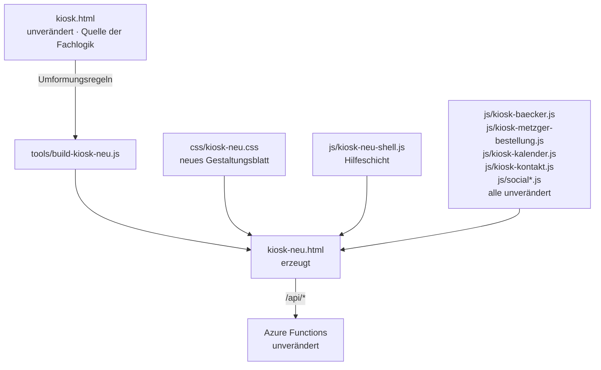

# Kiosk-Gesamtumbau — Implementation Plan

> Derived from `spec.md`. The plan translates *what* (spec) into *how*.
> Do not introduce new behaviour here — if the plan needs a behaviour that is
> not in the spec, go back and update the spec first.

**Spec:** [spec.md](./spec.md)

**Status:** Draft

## Constitution Check

- [x] Spec exists and has no open `[NEEDS CLARIFICATION]` markers
      (alle drei am 08.09.2026 geklärt, siehe Abschnitt „Clarifications")
- [x] On-prem compatibility respected — es werden keine neuen Dienste
      eingeführt. Der Umbau ist reine Oberfläche; alle Schnittstellen unter
      `/api/*` bleiben unverändert.
- [x] No secrets introduced into the repo — es werden keine Zugangsdaten
      berührt; der Zweitkiosk nutzt dieselbe Anmeldung wie der bestehende.
- [x] Follows existing folder conventions — `static-site/` für Oberfläche,
      `static-site/css/` und `static-site/js/` für Beiwerk, `tests/` für
      Playwright, `specs/kiosk-umbau/` für diese Unterlagen.

## Technical Approach

### Der tragende Gedanke: Klassennamen-Treue

Der Kiosk umfasst rund 10 500 Zeilen, davon 166 verschiedene Bedienfunktionen.
Ein Nachbau dieser Fachlogik wäre weder in vertretbarer Zeit zu leisten noch
zu verantworten — jede nachgebaute Funktion ist eine mögliche Regression.

Die Untersuchung des Bestands hat einen deutlich besseren Weg gezeigt:

1. **Das gesamte Aussehen des Kiosks steckt in einem einzigen eingebetteten
   `<style>`-Block** in `kiosk.html`, Zeilen 17 bis 1380 (1 363 Zeilen).
2. **Die Reiterinhalte sind dünne Container.** `panel-baecker` enthält genau
   ein leeres `<div id="baecker-body">`, `panel-metzgerbest` ein
   `<div id="metzgerbest-body">`, `panel-kalender` ein `<div id="kal-root">`.
   Den Inhalt erzeugen die Module zur Laufzeit.
3. **Die Module erzeugen HTML mit festen Klassennamen.** Eine Auszählung über
   alle Module ergab 130 gemeinsame `k-*`-Klassen plus acht modulspezifische
   Gruppen: `mb-*` (60, Metzger Mair), `kal-*` (58, Kalender), `bk-*` (54,
   Bäcker), `kk-*` (17, Kontakt), `pk-*` (14), `fm-*` (13, Fleisch),
   `st-*` (12), `soc-*` (12).

Daraus folgt: **Wer den `<style>`-Block ersetzt und die Klassennamen beibehält,
baut den ganzen Kiosk um, ohne eine einzige Fachfunktion anzufassen.** Die
Module erzeugen weiterhin dieselben Elemente, sie sehen nur anders aus und
liegen anders. Der Funktionserhalt aus F7 ist damit **bauartbedingt** gegeben
und nicht Ergebnis sorgfältigen Abtippens.

### Kein Duplikat, sondern eine Umformung

Eine Kopie von `kiosk.html` mit 6 226 Zeilen wäre ab dem ersten Tag ein
Wartungsproblem: Jede Korrektur am laufenden Kiosk müsste doppelt gepflegt
werden, und beim Vergleich der beiden Dateien wäre nicht erkennbar, was
Absicht und was Versehen ist.

Stattdessen entsteht `kiosk-neu.html` **erzeugt** aus `kiosk.html` durch ein
kleines Werkzeug `tools/build-kiosk-neu.js` mit einer überschaubaren Zahl
benannter Umformungsregeln. Alles, was keine Regel trifft, ist
**zeichengleich** übernommen. Das hat drei Vorteile:

- Der Umbau ist als Liste von Regeln lesbar und prüfbar, nicht als 6 000-Zeilen-Diff.
- `kiosk.html` bleibt die einzige Quelle der Fachlogik; kein Auseinanderlaufen.
- Nach der Abnahme wird aus der Umformung ein einmaliger Schreibvorgang:
  `kiosk-neu.html` ersetzt `kiosk.html`, das Werkzeug entfällt.

### Die drei neuen Bausteine

| Baustein | Inhalt |
| --- | --- |
| `css/kiosk-neu.css` | Das neue Gestaltungsblatt. Deckt dieselben Klassennamen ab wie der alte `<style>`-Block, setzt aber das Raster, die Umschaltpunkte und die 44-px-Regel aus dem abgenommenen Entwurf um. Der weitaus größte Teil der Arbeit. |
| `js/kiosk-neu-shell.js` | Die **Hilfeschicht**. Wird nur vom Zweitkiosk geladen und ergänzt die bestehenden Module von außen: Vorschlagsleisten, Vorbelegung, Rückgängig, das gemeinsame Dialogmuster. Sie ruft ausschließlich vorhandene `K.*`- und Modulfunktionen auf und ändert keine. |
| `tools/build-kiosk-neu.js` | Die Umformung. Erzeugt `static-site/kiosk-neu.html` aus `static-site/kiosk.html`. |

Die Hilfeschicht arbeitet **additiv**: Sie beobachtet die von den Modulen
erzeugten Elemente (`MutationObserver` auf den Panel-Containern) und hängt
Bedienhilfen an, statt die Module umzuschreiben. Damit bleibt
`kiosk-metzger-bestellung.js` unangetastet — genau die Datei, die das größte
Regressionsrisiko trüge.

## Key Decisions

| Decision | Options considered | Choice & rationale |
| --- | --- | --- |
| Umbauform | (A) Kiosk neu schreiben · (B) `kiosk.html` in Kopie umbauen · (C) Gestaltungsblatt austauschen, Klassennamen behalten | **C.** Nur so bleiben 166 Funktionen bauartbedingt erhalten. A ist bei 10 500 Zeilen unverantwortlich, B läuft sofort auseinander. |
| Zweite Datei | (A) Handkopie · (B) erzeugt aus dem Original | **B.** Alles ohne Regel ist zeichengleich; der Umbau ist als Regelliste prüfbar; kein Doppelpflegen. |
| Bedienhilfen aus F5 | (A) in die Module einbauen · (B) additive Schicht darüber | **B.** Die Module bleiben unverändert, dadurch kein Regressionsrisiko in der Fachlogik. Nach der Abnahme kann man sie hineinziehen. |
| Dialoge aus F6 | (A) `inSicht()` verbessern · (B) zentrales Blattmuster rein über CSS | **B.** `.mb-ed`, `.mb-dlg` und `.mb-overlay` werden per CSS zum Blatt am unteren Rand (Telefon) bzw. zur angedockten Spalte (ab 1180 px). Kein JavaScript nötig, wirkt für alle Module gleich. |
| Reiterleiste | siehe C1 in der Spec | Telefon unten, ab 640 px links, ab 1180 px breit links. |
| Ausgeblendete Reiter | siehe C2 | Bleiben ausgeblendet, werden aber mit umgebaut und zum Prüfen einblendbar. |
| Katalog in „Social" | siehe C3 | Bleibt im Kiosk, Felder erscheinen erst beim Bearbeiten eines Eintrags. |
| Prüfung | (A) nur Playwright · (B) Live-Daten über den Dev-Proxy | **B, zusätzlich zu A.** Live-Daten haben im Entwurf vier Fehler aufgedeckt, die mit Beispieldaten unsichtbar waren (abgeschnittene Artikelnamen, gekappte Umlautpunkte, verdeckte Liste, Leerraum). |

## Architecture



### Die Umformungsregeln

Jede Regel greift an einem stabilen Anker in `kiosk.html`. Trifft ein Anker
nicht, bricht das Werkzeug mit einer klaren Meldung ab — ein stillschweigend
übersprungener Umbau wäre der gefährlichste Fehler.

| Nr | Anker | Umformung |
| --- | --- | --- |
| R1 | `<style>` … `</style>` im Kopf (Z. 17–1380) | Ersetzt durch `<link rel="stylesheet" href="/css/kiosk-neu.css">` |
| R2 | Kopfleiste `<div class="k-header">` … | Ersetzt durch die neue, gestraffte Kopfzeile mit Bereichsnamen `hd` |
| R3 | `<!-- ═══ Tab bar ═══ -->` … `</div>` | Ersetzt durch die neue Reiterleiste mit Bereichsnamen `nav` |
| R4 | `<div class="k-main">` | Umschlossen vom Raster `<div class="k-app">` |
| R5 | Katalogbereich in `panel-social` | Einträge als Zeilen mit „Bearbeiten"; Felder nur für den offenen Eintrag (C3, TC-F5-06) |
| R6 | vor `</body>` | `<script src="/js/kiosk-neu-shell.js"></script>` ergänzt |
| R7 | `<title>` und Umgebungshinweis | Deutlich sichtbarer Hinweis „Umbau — wirkt auf echte Daten" (F11) |

### Das Raster

Übernommen aus dem abgenommenen Entwurf, unverändert:

```
Bereiche:  hd · days · ovl · chips · list · foot · nav
```

| Ab Breite | Anordnung |
| --- | --- |
| 0 px | Eine Spalte, Reiterleiste **unten**, Symbol über Beschriftung |
| 640 px | Reiterleiste **links**, schmal |
| 940 px | Liste zweispaltig |
| 1180 px | Reiterleiste links breit, Symbol **neben** Beschriftung; Detailblatt wird angedockte Spalte |
| 1620 px | Breitbild, Liste mehrspaltig |

Umgesetzt mit Container-Abfragen (`container-type:inline-size` auf dem
Bildschirm, benutzerdefinierte Eigenschaften mit `cqi` auf dem **Kind** `.k-app`
— auf dem Container selbst wirken sie nicht).

## File-Level Change Map

| Path | Change | Purpose |
| --- | --- | --- |
| `static-site/css/kiosk-neu.css` | new | Neues Gestaltungsblatt: Raster, Umschaltpunkte, 44-px-Regel, feste Kopfbereiche, Blattmuster für Dialoge. Deckt die 130 `k-*`-Klassen und die Modulgruppen `mb-* kal-* bk-* kk-* pk-* fm-* st-* soc-*` ab. |
| `static-site/js/kiosk-neu-shell.js` | new | Hilfeschicht: Vorschlagsleisten, Vorbelegung, Rückgängig, Dialogverwaltung, Zählerpflege. Additiv, ändert keine Modulfunktion. |
| `tools/build-kiosk-neu.js` | new | Erzeugt `kiosk-neu.html` aus `kiosk.html` nach den Regeln R1–R7; bricht bei fehlendem Anker ab. |
| `static-site/kiosk-neu.html` | new (erzeugt) | Der lauffähige Zweitkiosk (F11). Wird eingecheckt, damit er ohne Werkzeuglauf erreichbar ist. |
| `static-site/kiosk.html` | **unverändert** | Bleibt in Betrieb, dient als Quelle und Vergleichsmaßstab. |
| `static-site/js/kiosk-baecker.js` | **unverändert** | — |
| `static-site/js/kiosk-metzger-bestellung.js` | **unverändert** | — |
| `static-site/js/kiosk-kalender.js` | **unverändert** | — |
| `static-site/js/kiosk-kontakt.js` | **unverändert** | — |
| `static-site/js/social.js`, `social-poster.js` | **unverändert** | — |
| `api/**` | **unverändert** | Keine Schnittstellenänderung. |
| `tests/kiosk-neu.spec.js` | new | Playwright: F1–F6, F9, F10 über alle Prüfbreiten. |
| `tests/kiosk-neu-funktionen.spec.js` | new | TC-F7-01: Abgleich des Funktionsverzeichnisses zwischen `kiosk.html` und `kiosk-neu.html`. |
| `specs/kiosk-umbau/tasks.md` | new | Aufgabenliste. |

## Test Strategy

- **Unit:** Für `tools/build-kiosk-neu.js` ein Selbsttest: Jede Regel R1–R7 muss
  gegriffen haben, und die erzeugte Datei muss außerhalb der Regelbereiche
  zeichengleich mit `kiosk.html` sein. Das ist der eigentliche Beweis des
  Funktionserhalts.
- **Integration / E2E:** Playwright gegen den Dev-Proxy auf Port 8787 mit
  **echten Daten**. Je Reiter und je Prüfbreite:
  - kein waagerechter Überlauf (F2),
  - jede Antippfläche ≥ 44 × 44 px (F4),
  - Kopfbereiche bleiben beim Scrollen stehen (F3),
  - jeder Erfassungsdialog vollständig im Blickfeld (F6),
  - Reiter samt Zählern sichtbar (F1, F9).
- **Prüfbreiten:** 320, 360, 375, 390, 412, 430, 744, 768, 1024, 1280, 1920 px.
  Die von der Verfassung geforderten 375 × 667, 768 × 1024 und 1280 × 800 sind
  enthalten.
- **Ausgeblendete Reiter:** werden für die Prüfung eingeblendet (C2, TC-F8-01).
- **Mapping:** jede Anforderung wird über die Traceability-Tabelle in
  `tasks.md` auf mindestens eine Aufgabe und einen Testfall abgebildet.

### Messfallen, die im Testcode berücksichtigt sein müssen

Diese Punkte haben beim Entwurf Zeit gekostet und sind im Prüfcode zu beachten:

- **Skalierte Rahmen verfälschen jede Messung.** `getBoundingClientRect` liefert
  skalierte Werte, `clientWidth` echte CSS-Pixel. Ohne Umrechnung melden
  44-px-Knöpfe fälschlich 27 px.
- **Waagerecht scrollende Leisten** (`.k-day-bar`, `.k-filter-bar`) ragen
  absichtlich über den Rand. Die Überlaufprüfung muss Kinder scrollbarer
  Vorfahren ausnehmen.
- **Zähler ragen absichtlich über ihr Symbol** — `.k-tab-icon` von der
  Überlaufprüfung ausnehmen.
- **`line-height` unter 1,25 kappt Umlautpunkte** bei großen Schriftgraden.
- **Ausrichtung** nur zwischen vergleichbaren Elementen prüfen: Überblickskarte
  gegen die letzte Karte der ersten Zeile.

## Risks & Mitigations

| Risk | Impact | Mitigation |
| --- | --- | --- |
| Ein Modul erzeugt Klassen, die das neue Blatt nicht abdeckt → unformatierte Stellen | hoch | Vollständige Klassenauszählung liegt vor (380 Klassen). Zusätzlich ein Prüflauf, der alle Reiter öffnet und Elemente ohne wirksame Regel meldet. |
| `.mb-ed` lässt sich nicht rein über CSS ins Blickfeld holen | mittel | Rückfallebene: Die Hilfeschicht hängt den Editor beim Öffnen an einen festen Blattbehälter um — ohne die Modulfunktion zu ändern. |
| Umformungsanker bricht bei künftigen Änderungen an `kiosk.html` | mittel | Das Werkzeug bricht laut ab, statt still zu überspringen. Anker sind stabile HTML-Kommentare. |
| Bestehende Playwright-Tests greifen auf alte Selektoren zu | mittel | Klassennamen und Element-Kennungen bleiben erhalten — genau deshalb. Abweichungen fallen im Testlauf sofort auf. |
| Der Zweitkiosk wirkt auf echte Daten; jemand hält ihn für eine Vorschau | hoch | Dauerhaft sichtbarer Hinweisstreifen „Umbau — wirkt auf echte Daten" (F11, R7). |
| Social-Katalog: Umbau von 469 Feldern berührt echtes Markup | mittel | Regel R5 ist die einzige Regel, die Panel-Inhalt verändert. Sie wird gesondert gegen TC-F5-06 und die Katalogfunktionen geprüft. |

## Rollout

1. **Parallelbetrieb.** `kiosk-neu.html` liegt neben `kiosk.html`. Beide sind
   erreichbar, beide arbeiten auf denselben Daten. Kein Umschalten nötig.
2. **Lokale Abnahme** über den Dev-Proxy: `node files/dev-proxy.js 8787 static-site`,
   dann `http://localhost:8787/kiosk-neu.html`. Damit prüft der Auftraggeber
   jede Funktion mit echten Daten, bevor irgendetwas ausgerollt wird.
3. **Veröffentlichung** über den bestehenden Weg der Static Web App. Der
   Zweitkiosk ist erreichbar, der laufende Kiosk unberührt.
4. **Übernahme** erst nach ausdrücklicher Freigabe: `kiosk-neu.html` wird zu
   `kiosk.html`, `tools/build-kiosk-neu.js` und die Regelliste entfallen, das
   Gestaltungsblatt bleibt ausgelagert.
5. **Version** in `version.json` erhöhen, wie im Repository üblich.
