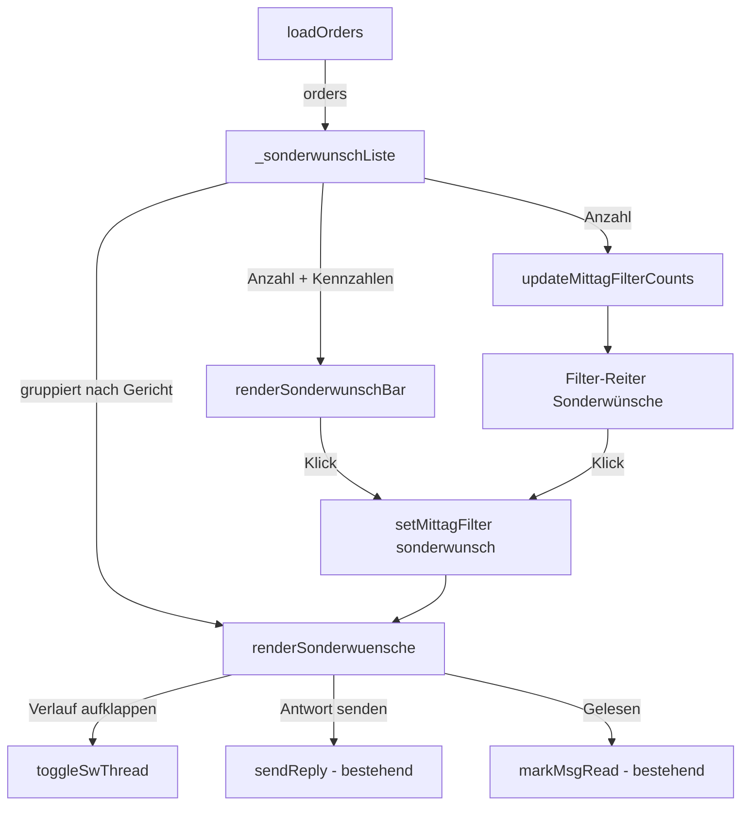

# Mittagstisch — Sonderwünsche auf einen Blick — Implementation Plan

> Derived from `spec.md`. The plan translates *what* (spec) into *how*.
> Do not introduce new behaviour here — if the plan needs a behaviour that is
> not in the spec, go back and update the spec first.

**Spec:** [spec.md](./spec.md)

**Status:** Ready for Tasks

## Constitution Check

- [x] Spec exists and has no open `[NEEDS CLARIFICATION]` markers
- [x] On-prem compatibility respected (no cloud-only APIs) — reine Frontend-Logik
      auf bereits geladenen Daten, kein neuer Dienst
- [x] No secrets introduced into the repo
- [x] Follows existing folder conventions (`specs/<feature>/`, `static-site/`,
      `tests/`)
- [x] Prinzip 6: Leerzustand und Hinweise in Klartext, bestehende Toast-/Dialog-
      Komponenten, kein `alert()`
- [x] Prinzip 7 + 8: Playwright-Spec über alle drei Viewports

## Technical Approach

Die gesamte Funktion entsteht im Mittagstisch-Teil von
[static-site/kiosk.html](../../static-site/kiosk.html). Sie arbeitet
**ausschließlich auf dem bereits vorhandenen `orders`-Array**, das `loadOrders()`
für den gewählten Tag füllt. Es gibt keinen neuen Request, keinen neuen
Endpunkt und keine Änderung an `api/`.

Kernstück ist eine reine Ableitungsfunktion `_sonderwunsch(o)`, die zu einer
Bestellung entweder `null` oder `{text, weitere[]}` liefert (Spec F1). Alles
Weitere — Zähler, Leiste, Liste, Kompaktansicht — baut auf dieser einen Funktion
auf, damit Leiste und Reiter niemals abweichende Zahlen zeigen können.

Die Ansicht wird als **weiterer Wert des bestehenden Statusfilters**
(`_mittagFilter = 'sonderwunsch'`) umgesetzt, analog zum bereits vorhandenen
Sonderfall `'nachrichten'`. Damit greifen die vorhandenen Mechanismen für
Filterwechsel, Auto-Refresh und Zähleraktualisierung ohne Umbau.

Für das Antworten aus dem aufgeklappten Verlauf wird die bestehende Funktion
`sendReply(id)` wiederverwendet. Sie liest ihr Eingabefeld über die ID
`rpt-<orderId>`; die Sonderwunsch-Karte vergibt dieselbe ID, sodass Antworten,
optimistisches Rendern und Push-Benachrichtigung unverändert funktionieren.
Ebenso wird `markMsgRead(id)` unverändert genutzt.

## Key Decisions

| Decision | Options considered | Choice & rationale |
| --- | --- | --- |
| Wo lebt die Ansicht? | (a) eigener Haupt-Tab, (b) zusätzlicher Statusfilter, (c) Overlay | **(b)** — fügt sich in `setMittagFilter` ein, erbt Auto-Refresh und Tageswechsel, kein neuer Navigationspfad |
| Datenquelle | (a) neuer Request `mode=sonderwunsch`, (b) vorhandenes `orders`-Array | **(b)** — die Daten sind bereits vollständig geladen; kein Backend-Aufwand, keine Latenz, immer konsistent mit der Bestellliste |
| Sonderwunsch-Ermittlung | verstreute Bedingungen je Ort | **eine** Funktion `_sonderwunsch(o)` als einzige Wahrheitsquelle für Zähler, Leiste und Liste |
| Antwort-Logik | eigene Sendefunktion | **`sendReply` wiederverwenden** über identische Feld-ID `rpt-<id>`; kein zweiter Sendeweg (Spec-Entscheidung 9) |
| Verlauf-Aufklappzustand | Neu-Rendern verwirft ihn | Zustand in `_swThreadOpen{}` je Bestell-ID halten, wie `_orderCardOpen` bei den Bestellkarten |
| Kompakt/Details | zwei getrennte Renderfunktionen | **ein** Renderpfad mit Modus-Schalter `_swCompact`; garantiert gleiche Menge und Reihenfolge (TC-F6-03) |
| Leiste sichtbar in welcher Ansicht? | immer | ausgeblendet in `nachrichten` und `sonderwunsch` (dort redundant), sonst sichtbar — analog Kochbedarf-Leiste |

## Architecture



Aufrufkette beim Rendern (bestehende Funktionen in Klammern):

1. `(loadOrders)` → `(updateMittagFilterCounts)` → Zähler `mt-fc-sonderwunsch`
2. `(loadOrders)` → `(renderOrders)` → `(renderCookBar)` + neu `renderSonderwunschBar()`
3. `(renderOrders)` verzweigt bei `_mittagFilter === 'sonderwunsch'` nach
   `renderSonderwuensche()` statt in die Gerichtsgruppen-Logik

## File-Level Change Map

| Path | Change | Purpose |
| --- | --- | --- |
| `static-site/kiosk.html` | edit — CSS | Block „Sonderwunsch-Leiste & -Liste" nach dem Kochbedarf-CSS (~Z. 279): `.k-sw-bar`, `.k-sw-card`, `.k-sw-note`, `.k-sw-more`, `.k-sw-thread`, `.k-sw-row`; Bernstein-Palette `#fffbeb / #f59e0b / #92400e`; Tap-Targets ≥44px; Dark-Mode-Overrides analog zu den bestehenden `html[data-theme="dark"]`-Regeln |
| `static-site/kiosk.html` | edit — HTML | `<div id="mittag-sonder"></div>` als Host für die Leiste direkt nach `<div id="mittag-cook">` (Z. 766); neuer Filter-Knopf `data-mt-filter="sonderwunsch"` mit `<span id="mt-fc-sonderwunsch">` zwischen „Offen" und „Nachrichten" (Z. 769/770) |
| `static-site/kiosk.html` | edit — JS | Neue Funktionen `_sonderwunsch(o)`, `_sonderwunschListe()`, `renderSonderwunschBar()`, `renderSonderwuensche()`, `_renderSwCard(o,sw)`, `_renderSwRow(o,sw)`, `toggleSwThread(id)`, `toggleAllSwThreads()`, `setSwCompact(v)`; Zustand `_swThreadOpen`, `_swCompact`, `_swAllOpen` |
| `static-site/kiosk.html` | edit — JS | `setMittagFilter()` um den Zweig `'sonderwunsch'` erweitern; `renderOrders()` verzweigt vor der Gerichtsgruppen-Logik; `renderCookBar()` und die neue Leiste blenden sich bei `'sonderwunsch'` aus; `updateMittagFilterCounts()` setzt den neuen Zähler; `K`-Export um die neuen Funktionen ergänzen (Namespace am Dateiende) |
| `static-site/kiosk.html` | edit | `version.json`-Bump erfolgt über den bestehenden CI-Schritt — hier keine Änderung nötig |
| `tests/kiosk-sonderwuensche.spec.js` | new | Playwright-Spec für TC-F1-01 … TC-F7-03 mit gemocktem `GET /api/lunch-order` (Muster: `tests/kiosk-kalender.spec.js`) |
| `tests/TESTCASES.md` | edit | Neue Test-Cases in die Übersicht eintragen |
| `specs/mittagstisch-sonderwuensche/{spec,plan,tasks}.md` | new | SDD-Artefakte |
| `mockups/sonderwuensche-mockup.html` | vorhanden | Referenz-Design, bleibt als Dokumentation liegen |

## Detailed Design

### `_sonderwunsch(o)` — die eine Wahrheitsquelle (F1)

```
wenn o.status === 2            -> null
txt   = trim(o.anmerkung)
verl  = Array.isArray(o.verlauf) ? o.verlauf : []
wenn txt nicht leer            -> { text: txt, weitere: verl }
sonst
  i = Index der ersten Nachricht in verl mit who === 'kunde' und nicht leerem text
  wenn i < 0                   -> null
  sonst                        -> { text: trim(verl[i].text), weitere: verl.slice(i+1) }
```

`weitere` wird zusätzlich um Einträge ohne `text` bereinigt, damit der Zähler
„Weitere Nachrichten (n)" nicht zu hoch ausfällt.

### `_sonderwunschListe()` — Gruppierung (F4)

Liefert `{gruppen:[{gericht, eintraege:[{o, sw}]}], anzahl, portionen, ungelesen, mitChat}`.

- Gruppenreihenfolge: Portionssumme je Gericht **absteigend** — dieselbe
  Sortierung wie `renderCookBar()` (Spec-Entscheidung 8).
- Innerhalb der Gruppe: ungelesene zuerst (`_hasUnseenComment(o)`), danach
  `localeCompare` auf `o.name`.
- `portionen` = Summe `menge` der Bestellungen **mit** Sonderwunsch.

### Leiste (F2)

`renderSonderwunschBar()` schreibt nach `#mittag-sonder`:

- `innerHTML = ''`, wenn `anzahl === 0` oder
  `_mittagFilter ∈ {'nachrichten','sonderwunsch'}`.
- Sonst: große Zahl, Titel „Sonderwünsche heute/für <Tag>", Unterzeile
  „`n` von `gesamt` Bestellungen · `u` noch nicht gelesen · `m` mit weiterer
  Rückfrage" (die letzten beiden Teile nur bei `> 0`), Knopf „Alle anzeigen".
- Ganze Leiste und Knopf rufen `K.setMittagFilter('sonderwunsch')`.

### Liste und Karte (F4, F5)

Je Eintrag:

- Kopf: Name, `menge`+„×", Preis, Badges (Quelle, `MIT`, Status, `NEU` bei
  ungelesener Nachricht).
- Wunschbox: `esc(sw.text)` auf Bernstein, Label „Sonderwunsch", `overflow-wrap:anywhere`.
- Verlaufzeile:
  - `sw.weitere.length > 0` → Knopf `K.toggleSwThread('<id>')`, Text
    „Weitere Nachrichten (n)"; ungelesene zusätzlich ausgewiesen.
  - sonst → `<div>` „Keine weiteren Nachrichten", nicht anklickbar.
- Aufgeklappt: Chatblasen (Kunde links `#eff6ff`, Dorfladen rechts `#f0fdf4`)
  plus Antwortzeile mit `<textarea id="rpt-<id>">` und Knopf → `K.sendReply('<id>')`.
- Da `sendReply` optimistisch `renderOrders()` aufruft, landet man wieder in
  `renderSonderwuensche()` — der Aufklappzustand kommt aus `_swThreadOpen` und
  der Text aus dem bestehenden `_preserveInputs`/`_restoreInputs`-Paar.

### Kompaktansicht (F6)

`_swCompact` (Boolean, Modul-Zustand, überlebt Neu-Rendern und Tageswechsel).
`_renderSwRow` erzeugt eine Zeile: `menge×` · Name · Gericht · Wunschtext —
ohne Verlauf, ohne `textarea`. Gruppenköpfe bleiben identisch, damit TC-F6-03
(gleiche Menge/Reihenfolge) trivial erfüllt ist.

### Integration in bestehende Funktionen

| Funktion | Änderung |
| --- | --- |
| `setMittagFilter(f)` | `f === 'sonderwunsch'` → `renderOrders()` (kein eigener Ladepfad, Daten sind da) |
| `renderOrders()` | direkt nach `renderCookBar()`: `renderSonderwunschBar()`; danach `if(_mittagFilter==='sonderwunsch'){ renderSonderwuensche(); return; }` |
| `renderCookBar()` | Ausblendbedingung um `'sonderwunsch'` erweitern |
| `updateMittagFilterCounts()` | `mt-fc-sonderwunsch` setzen; Reiter bernsteinfarben hervorheben, solange `anzahl > 0` |
| `loadOrders()` | Ladeplatzhalter-Bedingung um `'sonderwunsch'` erweitern, damit der Auto-Refresh die Ansicht nicht wegblendet (F3, TC-F3-03) |
| `K = { … }` | neue Funktionen exportieren |

## Test Strategy

- **Unit:** keine eigene Unit-Ebene im Projekt; die Ableitungsregeln aus F1
  werden über die E2E-Spec mit präpariertem Mock-Datensatz abgedeckt.
- **Integration / E2E:** neue Datei `tests/kiosk-sonderwuensche.spec.js`.
  `GET **/api/lunch-order**` wird per `page.route` mit einem festen Datensatz
  beantwortet (Muster aus `tests/kiosk-kalender.spec.js`), alle übrigen
  `**/api/**`-Aufrufe mit leeren Erfolgsantworten. Dadurch sind Zähler,
  Gruppierung und Reihenfolge deterministisch prüfbar.
- **Viewports:** Die Spec läuft über die drei konfigurierten Projekte
  (`mobile`, `ipad-mini`, `desktop`). TC-F7-02/03 prüfen Überlauf und
  Tap-Targets explizit.
- **Mapping:**

| Requirement | Test Cases | Ort |
| --- | --- | --- |
| F1 | TC-F1-01 … TC-F1-05 | `kiosk-sonderwuensche.spec.js` → „Sonderwunsch-Ermittlung" |
| F2 | TC-F2-01 … TC-F2-03 | → „Sonderwunsch-Leiste" |
| F3 | TC-F3-01 … TC-F3-03 | → „Filter-Reiter" |
| F4 | TC-F4-01 … TC-F4-04 | → „Liste" |
| F5 | TC-F5-01 … TC-F5-05 | → „Verlauf" |
| F6 | TC-F6-01 … TC-F6-03 | → „Kompaktansicht" |
| F7 | TC-F7-01 … TC-F7-03 | → „Leerzustand & Responsive" |

## Risks & Mitigations

| Risk | Impact | Mitigation |
| --- | --- | --- |
| Auto-Refresh verwirft Aufklappzustand oder getippte Antwort | mittel | Zustand in `_swThreadOpen`; Eingaben über das bestehende `_preserveInputs`/`_restoreInputs` erhalten; TC-F3-03 sichert das ab |
| Doppelte Element-IDs `rpt-<id>`, wenn Bestellliste und Sonderwunschliste gleichzeitig im DOM stehen | mittel | Beide Ansichten rendern in denselben Container `#mittag-orders` und schließen sich gegenseitig aus — es existiert immer nur eine |
| Filterleiste wird auf 375px zu breit | niedrig | `.k-filter-bar` scrollt bereits horizontal (`overflow-x:auto`); Label auf Mobile kürzen, Zähler bleibt sichtbar |
| Kundentext enthält HTML | hoch (XSS) | Ausgabe konsequent über die bestehende `esc()`-Funktion; TC-F4-04 prüft das |
| Sortierung weicht von der Kochbedarf-Leiste ab und verwirrt | niedrig | Dieselbe Sortierlogik (Portionen absteigend) in `_sonderwunschListe()` |
| Tests laufen standardmäßig gegen die Live-URL | mittel | Alle relevanten Requests werden gemockt; die Spec ist damit unabhängig von echten Tagesdaten |

## Rollout

- Reine Frontend-Änderung in einer bereits ausgelieferten Datei; kein
  API-Deployment, keine Migration, kein Konfigurationsschritt.
- Auslieferung über den bestehenden Static-Web-Apps-Workflow; der
  Versions-Bump in `static-site/version.json` passiert wie gewohnt automatisch.
- Rückbau im Notfall: Änderungen sind auf `kiosk.html` begrenzt und über einen
  Revert des Commits vollständig zurücknehmbar.
