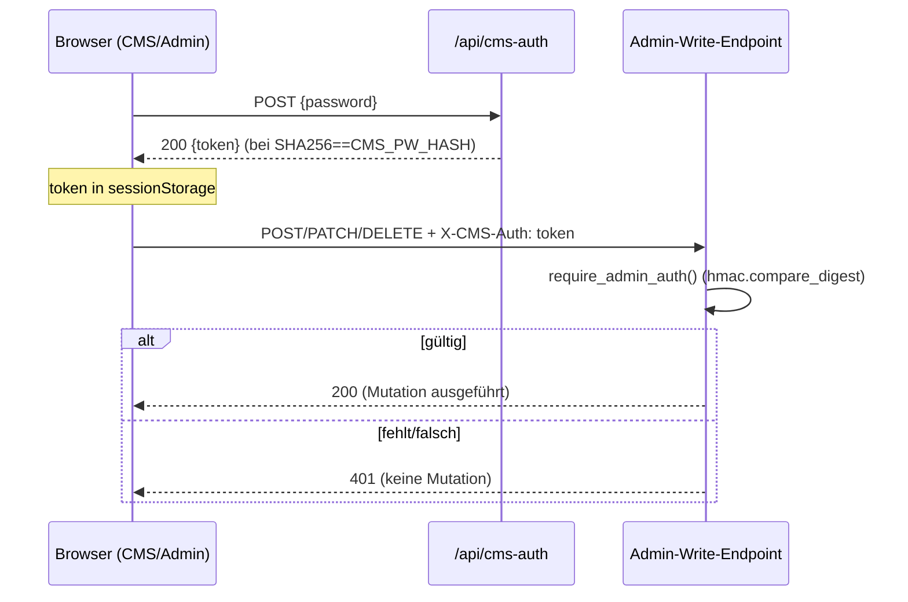

# Serverseitige Auth für Admin-/CMS-Write-Endpoints — Implementation Plan

> Abgeleitet aus [spec.md](./spec.md). Der Plan übersetzt *was* (Spec) in *wie*.
> Keine neuen Verhaltensweisen — steht etwas nicht in der Spec, zuerst die Spec
> aktualisieren.

**Spec:** [spec.md](./spec.md)

**Status:** Draft

## Constitution Check

- [x] Spec existiert und hat **keine** offenen `[NEEDS CLARIFICATION]`-Marker
- [x] On-prem-Kompatibilität nicht relevant (SWA/Functions), keine cloud-only Neuerung
- [x] **Keine** Secrets im Repo (Token/Hash nur als App-Settings)
- [x] Folgt bestehenden Ordner-Konventionen (`api/<name>/`, `api/shared/`)

## Technical Approach

Ein gemeinsames **statisches Token** (`CMS_AUTH_TOKEN`, App-Setting) sichert die
mutierenden Admin-/CMS-Endpunkte serverseitig ab.

1. **`api/shared/auth.py`** — `require_admin_auth(req)`: vergleicht den Header
   `X-CMS-Auth` konstant-zeitig (`hmac.compare_digest`) mit `CMS_AUTH_TOKEN`.
   Fehlt das App-Setting → `RuntimeError` (→ 500, kein stiller Durchlass).
   Hilfsfunktion `unauthorized_response()` liefert eine einheitliche `401`.
2. **`api/cms-auth/`** — neuer Endpoint `POST /api/cms-auth`: prüft
   `SHA-256(password) == CMS_PW_HASH`; bei Erfolg `200 {"token": CMS_AUTH_TOKEN}`,
   sonst `401`.
3. **Geschützte Endpunkte** rufen `require_admin_auth` am Anfang von `main()`
   für mutierende Methoden auf (`GET`/`OPTIONS` bleiben offen).
4. **Client** (CMS + Admin-Seiten): Login ruft `/api/cms-auth`, speichert Token
   in `sessionStorage`, ein Fetch-Wrapper hängt `X-CMS-Auth` an alle
   mutierenden Requests; bei `401` → Re-Login.

## Key Decisions

| Decision | Optionen | Wahl & Begründung |
| --- | --- | --- |
| Token-Art | statisch vs. HMAC/ablaufend | **statisch** (`CMS_AUTH_TOKEN`) — einfach, ausreichend; Rotation via App-Setting |
| Transport | Header vs. Cookie | **Header `X-CMS-Auth`** — kein CSRF-Cookie-Handling, einfacher CORS-Fall |
| Gate-Kriterium | pro Route vs. pro Methode | **pro Methode**: nur `POST/PUT/PATCH/DELETE`; `GET/OPTIONS` offen |
| Passwortprüfung | Client-Hash vs. Server | **Server** (`CMS_PW_HASH` App-Setting), Hash nicht mehr im HTML |
| Admin-Seiten | eigener vs. gemeinsamer Login | **gemeinsam**: `shop-admin`, `kiosk`, `shop-freigabe` nutzen dasselbe Token |

## Architecture

## Methoden-Matrix (aus `function.json` abgeleitet)

| Endpoint | Methoden | Geschützt (mutierend) |
| --- | --- | --- |
| `cms-config` | get, post | **POST** |
| `logo` | get, post, delete | **POST, DELETE** |
| `news-save` | post | **POST** |
| `news-delete` | delete | **DELETE** |
| `angebote` | get, post, patch, delete | **POST, PATCH, DELETE** |
| `wochenplan` | get, post, patch, delete | **POST, PATCH, DELETE** |
| `hours` | get, patch | **PATCH** |
| `werbebilder` | get, post | **POST** |
| `gallery` | get, post, put, patch, delete | **POST, PUT, PATCH, DELETE** |
| `social-post` | get, post, patch, delete | **POST, PATCH, DELETE** |
| `social-katalog` | get, post, patch, delete | **POST, PATCH, DELETE** |
| `meta-catalog` | get, post, delete | **POST, DELETE** |
| `shop-setup` | post | **POST** |
| `shop-admin` | get, patch, delete | **PATCH, DELETE** |
| `shop-freigabe` | get, post, delete | **POST, DELETE** |
| `push-send` | get, post, delete | **POST, DELETE** |
| `push-image` | get, post | **POST** |
| `tagespost` | get | — (nur GET, nichts zu schützen) |

> **Kunden-/öffentliche Endpunkte** (`auth-*`, `shop-order`, `lunch-order`,
> `fleisch-order`, `shop-articles`, `shop-favorites`, `push-subscribe`, `track`,
> `analytics`, `preisliste`, `roterpunkt`, `news`, `stammkunden`) bleiben
> **unverändert** (siehe Spec Non-Goals).

## File-Level Change Map

| Path | Change | Zweck |
| --- | --- | --- |
| `api/shared/auth.py` | new | `require_admin_auth`, `unauthorized_response` |
| `api/cms-auth/__init__.py` | new | Login-Endpoint (Passwort→Token) |
| `api/cms-auth/function.json` | new | httpTrigger `post, options`, anonymous |
| `api/cms-config/__init__.py` | edit | Guard für POST |
| `api/logo/__init__.py` | edit | Guard für POST/DELETE |
| `api/news-save/__init__.py` | edit | Guard für POST |
| `api/news-delete/__init__.py` | edit | Guard für DELETE |
| `api/angebote/__init__.py` | edit | Guard für POST/PATCH/DELETE |
| `api/wochenplan/__init__.py` | edit | Guard für POST/PATCH/DELETE |
| `api/hours/__init__.py` | edit | Guard für PATCH |
| `api/werbebilder/__init__.py` | edit | Guard für POST |
| `api/gallery/__init__.py` | edit | Guard für POST/PUT/PATCH/DELETE |
| `api/social-post/__init__.py` | edit | Guard für POST/PATCH/DELETE |
| `api/social-katalog/__init__.py` | edit | Guard für POST/PATCH/DELETE |
| `api/meta-catalog/__init__.py` | edit | Guard für POST/DELETE |
| `api/shop-setup/__init__.py` | edit | Guard für POST |
| `api/shop-admin/__init__.py` | edit | Guard für PATCH/DELETE |
| `api/shop-freigabe/__init__.py` | edit | Guard für POST/DELETE |
| `api/push-send/__init__.py` | edit | Guard für POST/DELETE |
| `api/push-image/__init__.py` | edit | Guard für POST |
| `static-site/cms.js` | edit | Login→`/api/cms-auth`, Token speichern, Fetch-Wrapper |
| `static-site/index.html` | edit | Homepage-Gate ruft `/api/cms-auth` |
| `static-site/shop-admin.html` | edit | gemeinsamer Login + `X-CMS-Auth` |
| `static-site/kiosk.html` | edit | gemeinsamer Login + `X-CMS-Auth` |
| `static-site/shop-freigabe.html` | edit | gemeinsamer Login + `X-CMS-Auth` |
| Azure App-Settings | ops | `CMS_PW_HASH`, `CMS_AUTH_TOKEN` (Prod + bestellsystem) |

## Test Strategy

- **Unit (pytest, `api/shared/auth.py`):** gültiges/fehlendes/falsches Token,
  fehlendes App-Setting → Fehler. Deckt **TC-F1-01…05**.
- **Endpoint-Integration:** repräsentative Endpunkte (`cms-config`, `logo`,
  `news-save`, `push-send`, `angebote`) — `401` ohne Token, `200` mit; `GET`
  offen. Deckt **TC-F1-01…04**, **TC-F3-01**.
- **Kunden-Regression:** `POST /api/shop-order` ohne `X-CMS-Auth` funktioniert →
  **TC-F3-02**.
- **`cms-auth`:** richtiges/falsches Passwort → **TC-F2-01/02**.
- **E2E (Playwright):** CMS-Login + Speichern trägt Header (**TC-F4-01**);
  geleerte Session → Re-Login (**TC-F4-02**). Read-only Smoke bleibt grün.

## Risks & Mitigations

| Risk | Impact | Mitigation |
| --- | --- | --- |
| App-Settings fehlen → alle Writes 500 | hoch | **Rollout-Reihenfolge** (unten); Settings zuerst setzen |
| Endpunkt vergessen zu schützen | hoch | Matrix als Checkliste in `tasks.md`; Integrationstest je Endpunkt |
| Kunden-Endpunkt versehentlich geschützt | hoch | Guard nur in gelisteten Dateien; TC-F3-02 |
| Client sendet Token nicht → UX-Bruch | mittel | zentraler Fetch-Wrapper statt Einzel-Fetches; 401→Re-Login |
| Token in Repo/Logs | hoch | nur App-Setting; nie loggen; `.gitignore` deckt local.settings |

## Rollout

Reihenfolge (verhindert 500 bei aktiver Prüfung):
1. **App-Settings** `CMS_PW_HASH` + `CMS_AUTH_TOKEN` in `dorfladen-website` und
   `dorfladen-bestellsystem` setzen.
2. `shared/auth.py` + `cms-auth`-Endpoint deployen.
3. Client auf `/api/cms-auth` + `X-CMS-Auth` umstellen.
4. Guards in den geschützten Endpunkten aktivieren.
5. Verifizieren (Integration + E2E), dann Merge.
